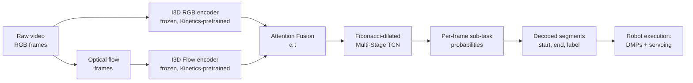

# RoboSubtaskNet — Reimplementation Plan

> **Status:** planning
> **Target effort:** ~2 weeks of focused engineering for the segmentation pipeline (Phases 0–3); +1–2 weeks for real-robot deployment (Phase 4).
> **Reference:** Sharma et al., *RoboSubtaskNet: Temporal Sub-task Segmentation for Human-to-Robot Skill Transfer in Real-World Environments*, arXiv:2602.10015.
> **Why this document exists:** the original authors have not released code; this spec is the basis for a clean open-source reimplementation.

---

## Table of Contents

1. [Goal & Scope](#1-goal--scope)
2. [Methodological Summary](#2-methodological-summary)
3. [Repository Layout](#3-repository-layout)
4. [Environment & Dependencies](#4-environment--dependencies)
5. [Datasets](#5-datasets)
6. [Feature Extraction Pipeline](#6-feature-extraction-pipeline)
7. [Attention Fusion Module](#7-attention-fusion-module)
8. [Fibonacci-Dilated Multi-Stage TCN](#8-fibonacci-dilated-multi-stage-tcn)
9. [Composite Loss Function](#9-composite-loss-function)
10. [Training Procedure](#10-training-procedure)
11. [Evaluation Metrics](#11-evaluation-metrics)
12. [Robot Execution Pipeline (Phase 2)](#12-robot-execution-pipeline-phase-2)
13. [Reproducibility & Logging](#13-reproducibility--logging)
14. [Testing Strategy](#14-testing-strategy)
15. [Phased Milestones](#15-phased-milestones)
16. [Risks & Open Decisions](#16-risks--open-decisions)
17. [References](#17-references)

---

## 1. Goal & Scope

**Goal.** Reproduce the RoboSubtaskNet pipeline end-to-end: from raw demonstration videos to per-frame sub-task labels that map deterministically onto manipulator primitives. The primary deliverable is the **temporal segmentation** component; the robot-side execution stack (DMPs, visual servoing) is a secondary, optional deliverable.

**In scope (Phase 1).**
- I3D feature extraction for RGB and optical flow streams.
- Attention-based fusion of RGB and flow features.
- Fibonacci-dilated multi-stage TCN.
- Composite loss: cross-entropy + truncated MSE + transition-aware term.
- Training/eval on GTEA and Breakfast (to reproduce paper numbers).
- Custom dataset ingestion in the same format.

**In scope (Phase 2, optional).**
- DMP learning per sub-task primitive.
- Object detection + visual servoing wrapper.
- Real-robot integration on a 7-DOF arm (Kinova Gen3 in the paper; any 6/7-DOF manipulator works).

**Out of scope.** Foundation-model / VLM-based approaches; we replicate RoboSubtaskNet specifically. If we later want to compare against VLM-style segmentation (Salfity, DexVLA, RoboCOIN), that lives in a separate branch.

**Strong opinion.** Do not attempt the custom dataset before reproducing GTEA numbers within ±2 percentage points. Without a benchmark anchor you cannot distinguish a code bug from a data problem from a method limitation; you will burn weeks chasing the wrong cause.

---

## 2. Methodological Summary



The pipeline is a strict feed-forward stack. There is no end-to-end backprop into I3D — it is used as a frozen feature extractor, in keeping with the MS-TCN tradition. Only the fusion module, the MS-TCN stages, and the classification heads are trained.

**Architectural deltas vs MS-TCN++ baseline.**

| Component        | MS-TCN++                                  | RoboSubtaskNet                                                    |
|------------------|-------------------------------------------|-------------------------------------------------------------------|
| Feature fusion   | Concatenation or single modality          | Learned per-frame gate $\alpha(t) \in [0,1]^{D}$                  |
| Dilation         | $d_l = 2^{l-1}$ (exponential)             | $d_l = F_{l+1}$ (Fibonacci)                                       |
| Loss             | CE + truncated MSE                        | CE + truncated MSE + transition-aware penalty                     |
| Receptive field  | Sparser, biased to long horizons          | Denser at short horizons; better for reach-pick-place transitions |

Everything else (multi-stage refinement, residual dilated blocks, 1×1 classification heads, segment-level metrics) is identical to MS-TCN++.

---

## 3. Repository Layout

```
robosubtasknet/
├── README.md
├── IMPLEMENTATION_PLAN.md      <-- this file
├── LICENSE                     <-- Apache 2.0 recommended
├── pyproject.toml
├── requirements.txt
├── .pre-commit-config.yaml
├── .github/
│   └── workflows/
│       ├── test.yml
│       └── lint.yml
├── configs/
│   ├── default.yaml
│   ├── gtea.yaml
│   ├── breakfast.yaml
│   └── robosubtask.yaml
├── src/
│   └── robosubtasknet/
│       ├── __init__.py
│       ├── data/
│       │   ├── __init__.py
│       │   ├── dataset.py          # PyTorch Dataset / DataLoader
│       │   ├── augmentations.py    # color jitter, random crop, etc.
│       │   ├── grammar.py          # task→sub-task transition rules
│       │   └── annotation.py       # parse label files
│       ├── features/
│       │   ├── __init__.py
│       │   ├── i3d.py              # I3D backbone wrapper
│       │   ├── flow.py             # TV-L1 / RAFT optical flow
│       │   └── extract.py          # CLI feature extraction
│       ├── models/
│       │   ├── __init__.py
│       │   ├── fusion.py           # AttentionFusion
│       │   ├── tcn.py              # FibonacciDilatedLayer, SingleStageTCN
│       │   └── robosubtasknet.py   # Full multi-stage model
│       ├── losses/
│       │   ├── __init__.py
│       │   ├── tmse.py             # TruncatedMSELoss
│       │   ├── transition.py       # TransitionLoss
│       │   └── composite.py        # CompositeLoss
│       ├── training/
│       │   ├── __init__.py
│       │   ├── trainer.py
│       │   ├── scheduler.py
│       │   └── callbacks.py
│       ├── eval/
│       │   ├── __init__.py
│       │   ├── metrics.py          # F1@k, Edit, Acc
│       │   └── evaluator.py
│       └── execution/              # Phase 2
│           ├── __init__.py
│           ├── dmp.py
│           ├── detection.py
│           └── servoing.py
├── scripts/
│   ├── extract_features.py
│   ├── train.py
│   ├── evaluate.py
│   ├── visualize_segmentation.py
│   └── run_robot.py
├── tests/
│   ├── test_fusion.py
│   ├── test_tcn.py
│   ├── test_losses.py
│   ├── test_metrics.py
│   ├── test_grammar.py
│   └── conftest.py
├── data/
│   ├── raw/                        # video files (gitignored)
│   ├── annotations/                # label files
│   ├── features/                   # precomputed I3D features
│   └── splits/                     # train/val/test indices
├── checkpoints/                    # gitignored
├── logs/                           # gitignored
└── notebooks/
    ├── 01_data_exploration.ipynb
    ├── 02_feature_visualization.ipynb
    └── 03_qualitative_results.ipynb
```

**Notes.**
- `src/` layout, not a flat package — needed for reproducible installation with `pip install -e .` and for clean test isolation.
- `configs/` uses Hydra-style composition; the `default.yaml` holds shared hyperparameters, and per-dataset files override what's specific.
- `data/`, `checkpoints/`, `logs/` are gitignored. Add a `.gitkeep` in each so structure is preserved.

---

## 4. Environment & Dependencies

**Python:** 3.10 or 3.11.
**Hardware target:** single GPU with ≥16 GB VRAM (24 GB recommended). MS-TCN models are tiny by modern standards; the heavy memory user is I3D inference, which can be done once and cached.
**OS:** Ubuntu 22.04 LTS recommended; macOS works for development without CUDA but is too slow for feature extraction.

### `requirements.txt`

```
# Core
torch>=2.1,<2.5
torchvision>=0.16
torchaudio>=2.1
pytorchvideo>=0.1.5
einops>=0.7
numpy>=1.24
scipy>=1.11

# Video / flow
av>=11
opencv-python>=4.8
opencv-contrib-python>=4.8         # for TV-L1 optical flow
decord>=0.6                        # fast video frame reader

# Config & logging
hydra-core>=1.3
omegaconf>=2.3
pyyaml>=6
tqdm>=4.66
tensorboard>=2.15
wandb>=0.16                        # optional

# Dev
pytest>=7.4
pytest-cov>=4.1
ruff>=0.1
mypy>=1.7
pre-commit>=3.5
```

### Optional dependencies

- `pydmps` for DMP learning (Phase 2).
- `ultralytics` or `transformers` for object detection (Phase 2).
- `roboticstoolbox-python` or `pinocchio` for kinematics (Phase 2).

### Installation

```bash
git clone https://github.com/<you>/robosubtasknet.git
cd robosubtasknet
python -m venv .venv && source .venv/bin/activate
pip install -e ".[dev]"
pre-commit install
```

`pyproject.toml` should declare `[project.optional-dependencies]` for `dev`, `flow-tvl1`, `robot`.

---

## 5. Datasets

The paper evaluates on three datasets: **GTEA**, **Breakfast**, and **RoboSubtask** (custom). We treat the first two as benchmark anchors and the third as the target.

### 5.1 Benchmark datasets (GTEA, Breakfast)

For both, precomputed I3D features are available from the original MS-TCN repository:
- https://github.com/yabufarha/ms-tcn (link in their README)

This is a major shortcut. Skip your own feature extraction for GTEA/Breakfast in Phase 0–3; use the published features directly. This guarantees that any deviation from paper numbers is due to *our model code*, not feature mismatch.

Expected files per dataset:
```
data/<dataset>/
├── features/
│   ├── <video_id>.npy        # shape [T, 2048] (RGB) or [T, 2*2048] (RGB+Flow concat)
│   └── ...
├── groundTruth/
│   └── <video_id>.txt        # one sub-task label per frame
├── splits/
│   ├── train.split1.bundle
│   ├── test.split1.bundle
│   └── ...                   # GTEA has 4 splits, Breakfast has 4, 50salads has 5
└── mapping.txt               # "0 background\n1 take\n2 open\n..."
```

The MS-TCN feature format pre-concatenates RGB+Flow into 2*1024 = 2048-dim vectors. **For RoboSubtaskNet we need them as two separate streams** so the attention module can mix them. Two options:

1. Split the published 2048-dim feature into two 1024-dim halves (the standard convention).
2. Re-extract features ourselves with separate streams.

Start with option (1) and validate that splitting reproduces the per-stream features as expected.

### 5.2 Custom RoboSubtask dataset

The paper's RoboSubtask is not released, so we build our own. The sub-task vocabulary (Table I in the paper):

```
Reach    — moving end-effector toward an object
Pick     — lifting an object
Place    — positioning an object at a target
Retract  — returning to home pose
Pour     — pouring contents from one object into another
Wipe     — cleaning a surface
Move     — translation while holding an object
```

Plus a `background` / `idle` class for unlabeled frames.

The task-to-sub-task grammar (Table II) defines which sub-task sequences are valid per task:

```yaml
# configs/grammar/robosubtask.yaml
tasks:
  pick_and_place:
    sequence: [reach, pick, move, place, retract]
  pick_and_pour:
    sequence: [reach, pick, move, pour, move, place, retract]
  cleaning:
    sequence: [reach, wipe, retract]
  pick_and_give:
    sequence: [reach, pick, give, retract]
```

This grammar drives the transition-aware loss (Section 9).

### 5.3 Recording protocol

For collecting the custom dataset, follow a tight protocol so labels are deterministic:

- Single fixed camera viewpoint per task (or a small set, ≤3 viewpoints).
- 30 fps, 1280×720, no auto-exposure changes mid-clip.
- One task per clip; clip starts before `reach` begins and ends after `retract` completes.
- Operator wears non-distinctive clothing; no other people in frame.
- Minimum 30 demonstrations per task; 50 if there's grasp variability.

### 5.4 Annotation format

Per-frame labels in a CSV:

```
frame_idx,subtask
0,background
1,background
2,reach
3,reach
...
217,pick
218,pick
...
```

For boundary precision, use a tool like CVAT or a simple homemade widget; the per-frame labeling decision lives entirely with annotators. Inter-annotator agreement should be measured on a 20-clip subset (target Cohen's κ ≥ 0.85).

---

## 6. Feature Extraction Pipeline

### 6.1 I3D backbone

I3D (Carreira & Zisserman, 2017) pretrained on Kinetics-400. Use `pytorchvideo`'s `i3d_r50`:

```python
# src/robosubtasknet/features/i3d.py
import torch
import torch.nn as nn
from pytorchvideo.models.hub import i3d_r50

class I3DFeatureExtractor(nn.Module):
    """Extract 1024-d features per temporal window from a frozen I3D-R50.

    Input: video tensor of shape [B, C, T, H, W], C=3 for RGB or C=2 for flow.
    Output: features [B, T_out, 1024], where T_out ≈ ceil(T / 8) due to I3D's
    temporal stride (8x downsampling through the network).
    """
    def __init__(self, modality: str = "rgb", pretrained: bool = True):
        super().__init__()
        assert modality in ("rgb", "flow")
        self.modality = modality
        self.model = i3d_r50(pretrained=pretrained)
        # Strip classification head; keep up to the final pooling
        self.model.blocks[-1].proj = nn.Identity()
        self.model.blocks[-1].activation = nn.Identity()
        self.model.eval()
        for p in self.parameters():
            p.requires_grad_(False)

    @torch.no_grad()
    def forward(self, x: torch.Tensor) -> torch.Tensor:
        # x: [B, C, T, H, W]
        # Returns [B, T_out, 1024]
        feat = self.model(x)
        return feat
```

**Important caveat.** The Kinetics-pretrained I3D flow stream was trained on **TV-L1** optical flow with a specific input normalization (values rescaled to [-1, 1] after clamping to ±20 pixels). If you swap in RAFT outputs without renormalization, the flow stream will see out-of-distribution inputs and feature quality will degrade. See §6.2.

### 6.2 Optical flow

Three choices, in increasing order of effort but also of quality:

| Method                     | Pros                                  | Cons                                                                 |
|----------------------------|---------------------------------------|----------------------------------------------------------------------|
| **Precomputed (MS-TCN)**   | Free; matches paper distribution      | Only available for GTEA / Breakfast / 50Salads                       |
| **TV-L1 (OpenCV)**         | Matches original I3D pretraining      | Slow (~1 fps on CPU); shaky on textureless regions                   |
| **RAFT (torchvision)**     | High quality, GPU-accelerated         | Distributional mismatch with Kinetics-pretrained I3D flow stream    |

**Recommendation.** For Phase 1–3 (reproducing GTEA/Breakfast), use precomputed features. For Phase 4 (custom dataset), use TV-L1 to maintain distributional compatibility with the I3D flow weights. RAFT is worth experimenting with later as a possible quality win — but it requires either fine-tuning the I3D flow head or accepting some performance loss.

TV-L1 implementation:

```python
# src/robosubtasknet/features/flow.py
import cv2
import numpy as np

class TVL1Flow:
    def __init__(self, bound: int = 20):
        self.alg = cv2.optflow.DualTVL1OpticalFlow_create()
        self.bound = bound

    def __call__(self, prev_gray: np.ndarray, curr_gray: np.ndarray) -> np.ndarray:
        # Returns [H, W, 2] with values in pixels
        flow = self.alg.calc(prev_gray, curr_gray, None)
        # Clip and rescale to [-1, 1] as in Kinetics-I3D preprocessing
        flow = np.clip(flow, -self.bound, self.bound) / self.bound
        return flow.astype(np.float32)
```

### 6.3 Storage format

After extraction, store per-video as a single `.npz`:

```
data/features/<dataset>/<video_id>.npz
├── rgb:    float16 [T_feat, 1024]
├── flow:   float16 [T_feat, 1024]
├── labels: int32   [T_feat]
└── meta:   {fps, original_T, video_path, hash}
```

float16 reduces disk by 2× with negligible impact on segmentation accuracy. Convert to float32 on load.

### 6.4 CLI

```bash
python scripts/extract_features.py \
    --videos data/raw/robosubtask/ \
    --annotations data/annotations/robosubtask/ \
    --output data/features/robosubtask/ \
    --flow tvl1 \
    --window 16 --stride 8
```

Window/stride matches Kinetics-I3D's standard (16 input frames, output features at 8-frame stride, so 8× temporal downsampling vs raw frames).

---

## 7. Attention Fusion Module

### 7.1 Formal definition

Given per-time-step RGB and flow features $f^{\text{rgb}}_t, f^{\text{flow}}_t \in \mathbb{R}^{D}$ (here $D = 1024$):

$$\alpha(t) = \sigma\!\left(W_a [f^{\text{rgb}}_t; f^{\text{flow}}_t] + b_a\right) \in [0, 1]^{D}$$

$$f^{\text{fused}}_t = \alpha(t) \odot f^{\text{rgb}}_t + (1 - \alpha(t)) \odot f^{\text{flow}}_t$$

where $\sigma$ is the elementwise sigmoid and $\odot$ is the Hadamard product. $W_a \in \mathbb{R}^{D \times 2D}$, $b_a \in \mathbb{R}^{D}$ are learned.

The paper specifies "a fully connected shallow layer." We interpret this as a single linear layer; an MLP with one hidden layer (dim $D/2$) is a defensible variant and worth ablating.

### 7.2 Implementation

```python
# src/robosubtasknet/models/fusion.py
import torch
import torch.nn as nn

class AttentionFusion(nn.Module):
    """Per-frame, per-channel gated fusion of two equally-sized feature streams.

    α(t) ∈ [0,1]^D selects between RGB (α=1) and flow (α=0) at each frame
    and each feature dimension independently. The gate is conditioned on the
    concatenation of both streams.
    """
    def __init__(self, dim: int = 1024, hidden: int | None = None):
        super().__init__()
        if hidden is None:
            self.gate = nn.Linear(2 * dim, dim)
        else:
            self.gate = nn.Sequential(
                nn.Linear(2 * dim, hidden),
                nn.GELU(),
                nn.Linear(hidden, dim),
            )

    def forward(self, rgb: torch.Tensor, flow: torch.Tensor) -> torch.Tensor:
        # rgb, flow: [B, T, D]
        alpha = torch.sigmoid(self.gate(torch.cat([rgb, flow], dim=-1)))
        return alpha * rgb + (1.0 - alpha) * flow

    def forward_with_gate(self, rgb, flow):
        """Diagnostic version that returns α as well, for visualization."""
        alpha = torch.sigmoid(self.gate(torch.cat([rgb, flow], dim=-1)))
        return alpha * rgb + (1.0 - alpha) * flow, alpha
```

Output shape: `[B, T, D]` — same as either input.

### 7.3 Diagnostic invariants

- If both inputs are equal, the gate has no preference; check $\|f^{\text{fused}} - f^{\text{rgb}}\|$ ≈ 0.
- If `gate.weight = 0` and `gate.bias` such that sigmoid → 0.5, the fused feature equals the average of the two streams.
- After training, log the per-sub-task average $\bar\alpha$ and verify it qualitatively matches paper's Table III (flow-dominant for `reach`, `move`, `wipe`; RGB-dominant for `pick`, `place`, `pour`).

---

## 8. Fibonacci-Dilated Multi-Stage TCN

### 8.1 Single-stage TCN with Fibonacci dilations

A single stage is a stack of $L$ residual blocks. Block $l$ has:
- 1D dilated convolution: kernel size $k = 3$, dilation $d_l = F_{l+1}$.
- 1×1 projection back to the residual stream.
- ReLU + dropout.
- Residual connection.

$$H^{(l)}_t = \mathrm{ReLU}\!\left( W^{(l)} *_{d_l} H^{(l-1)} + b^{(l)} \right) + H^{(l-1)}_t$$

The Fibonacci schedule $d_l = F_{l+1}$ gives dilations $(1, 2, 3, 5, 8, 13, 21, 34, 55, 89, \dots)$ for $l = 1, \dots, L$. Receptive field after $L$ layers with $k=3$:

$$\mathrm{RF}(L) = 1 + 2 \sum_{l=1}^{L} F_{l+1} = 1 + 2\left(F_{L+3} - 2\right)$$

For $L = 10$: $\mathrm{RF} = 1 + 2(F_{13} - 2) = 1 + 2 \cdot 231 = 463$ frames at I3D's output stride, equivalent to ~3700 raw frames (i.e., ~2 minutes at 30 fps) — sufficient for typical short-horizon manipulation tasks while remaining denser at short range than the MS-TCN++ exponential schedule.

### 8.2 Implementation

```python
# src/robosubtasknet/models/tcn.py
import torch
import torch.nn as nn
import torch.nn.functional as F

def fibonacci(n: int) -> list[int]:
    """Return F_2, F_3, ..., F_{n+1} (skipping the initial F_1=1 duplicate)."""
    fib = [1, 1]
    while len(fib) < n + 2:
        fib.append(fib[-1] + fib[-2])
    return fib[1:n + 1]  # F_2 .. F_{n+1}

class FibonacciDilatedLayer(nn.Module):
    def __init__(self, dim: int, dilation: int, dropout: float = 0.5):
        super().__init__()
        self.conv_dilated = nn.Conv1d(
            dim, dim, kernel_size=3, padding=dilation, dilation=dilation
        )
        self.conv_1x1 = nn.Conv1d(dim, dim, kernel_size=1)
        self.dropout = nn.Dropout(dropout)

    def forward(self, x: torch.Tensor) -> torch.Tensor:
        # x: [B, D, T]
        out = F.relu(self.conv_dilated(x))
        out = self.conv_1x1(out)
        out = self.dropout(out)
        return x + out

class SingleStageTCN(nn.Module):
    def __init__(
        self,
        num_layers: int,
        in_dim: int,
        hidden_dim: int,
        num_classes: int,
        dropout: float = 0.5,
    ):
        super().__init__()
        dilations = fibonacci(num_layers)
        self.proj_in = nn.Conv1d(in_dim, hidden_dim, kernel_size=1)
        self.layers = nn.ModuleList(
            FibonacciDilatedLayer(hidden_dim, d, dropout) for d in dilations
        )
        self.head = nn.Conv1d(hidden_dim, num_classes, kernel_size=1)

    def forward(self, x: torch.Tensor) -> torch.Tensor:
        # x: [B, D_in, T]
        h = self.proj_in(x)
        for layer in self.layers:
            h = layer(h)
        return self.head(h)  # [B, C, T]
```

### 8.3 Multi-stage refinement

Stages $s = 1, \dots, S$ refine each other's predictions. Stage 1 ingests the fused features; subsequent stages ingest the softmax probabilities from the previous stage:

$$Y^{(1)} = F\!\left( X^{\text{fused}} \right), \quad Y^{(s)} = F\!\left( \mathrm{softmax}(Y^{(s-1)}) \right) \text{ for } s = 2, \dots, S$$

```python
# src/robosubtasknet/models/robosubtasknet.py
class RoboSubtaskNet(nn.Module):
    def __init__(
        self,
        num_stages: int = 4,
        num_layers: int = 10,
        feature_dim: int = 1024,
        hidden_dim: int = 64,
        num_classes: int = 9,
    ):
        super().__init__()
        self.fusion = AttentionFusion(dim=feature_dim)
        self.stage_1 = SingleStageTCN(
            num_layers, feature_dim, hidden_dim, num_classes
        )
        self.refinement = nn.ModuleList(
            SingleStageTCN(num_layers, num_classes, hidden_dim, num_classes)
            for _ in range(num_stages - 1)
        )

    def forward(
        self, rgb: torch.Tensor, flow: torch.Tensor
    ) -> list[torch.Tensor]:
        # rgb, flow: [B, T, D]
        fused = self.fusion(rgb, flow)  # [B, T, D]
        fused = fused.transpose(1, 2)   # [B, D, T] for Conv1d
        outputs = [self.stage_1(fused)]
        for stage in self.refinement:
            outputs.append(stage(F.softmax(outputs[-1], dim=1)))
        return outputs  # list of [B, C, T]
```

Hidden dim = 64 matches MS-TCN's choice; it is *not* a typo for 640 or 1024. MS-TCN keeps the recurrent dim tiny because the dilated convolutions provide enough capacity.

---

## 9. Composite Loss Function

The training objective sums three terms per stage and aggregates over stages:

$$\mathcal{L} = \sum_{s=1}^{S} \left( \mathcal{L}^{(s)}_{\mathrm{CE}} + \lambda \mathcal{L}^{(s)}_{\mathrm{T\text{-}MSE}} + \gamma \mathcal{L}^{(s)}_{\mathrm{Trans}} \right)$$

Default: $\lambda = 0.15$ (matches MS-TCN), $\gamma \in [0.1, 0.3]$ to be grid-searched.

### 9.1 Cross-entropy

Per-frame:
$$\mathcal{L}_{\mathrm{CE}} = -\frac{1}{T} \sum_{t=1}^{T} \log p_{t, y_t}$$

Use PyTorch's `nn.CrossEntropyLoss(ignore_index=-100)` and mark padding frames as `-100`.

### 9.2 Truncated MSE smoothing

Penalizes large log-probability jumps between consecutive frames:

$$\mathcal{L}_{\mathrm{T\text{-}MSE}} = \frac{1}{T C} \sum_{t, c} \tilde\Delta_{t,c}^{2}, \quad \tilde\Delta_{t,c} = \min(\left|\log p_{t,c} - \log p_{t-1,c}\right|, \tau)$$

with $\tau = 4$ (paper default, log-prob units).

```python
# src/robosubtasknet/losses/tmse.py
import torch
import torch.nn as nn
import torch.nn.functional as F

class TruncatedMSELoss(nn.Module):
    def __init__(self, tau: float = 4.0):
        super().__init__()
        self.tau = tau

    def forward(self, logits: torch.Tensor, mask: torch.Tensor | None = None) -> torch.Tensor:
        # logits: [B, C, T], mask: [B, T] (1 for valid, 0 for padding)
        log_p = F.log_softmax(logits, dim=1)
        delta = log_p[:, :, 1:] - log_p[:, :, :-1]  # [B, C, T-1]
        delta = torch.clamp(delta.abs(), max=self.tau)
        sq = delta.pow(2)  # [B, C, T-1]
        if mask is not None:
            m = mask[:, 1:] * mask[:, :-1]  # [B, T-1]
            sq = sq * m.unsqueeze(1)
            return sq.sum() / (m.sum() * sq.size(1)).clamp(min=1)
        return sq.mean()
```

### 9.3 Transition-aware penalty

The paper specifies this term as discouraging *invalid* label transitions given the task grammar (Section 5.2). The exact formula isn't fully nailed down in the paper, so we adopt a defensible interpretation: penalize predicted probability mass that *flows* between forbidden labels.

Let $\mathcal{A} \subset \{1, \dots, C\}^2$ be the set of allowed ordered transitions $(c, c')$ from the grammar, including all self-transitions $(c, c)$. Define the forbidden mask:

$$M_{c, c'} = \mathbb{1}\left[ (c, c') \notin \mathcal{A} \right]$$

For each consecutive frame pair $t \to t+1$, the transition-aware loss is the expected forbidden-edge probability mass:

$$\mathcal{L}_{\mathrm{Trans}} = \frac{1}{T - 1} \sum_{t=1}^{T-1} \sum_{c, c'} p_{t, c} \, p_{t+1, c'} \, M_{c, c'}$$

This is differentiable and zero whenever predictions are consistent with the grammar.

```python
# src/robosubtasknet/losses/transition.py
import torch
import torch.nn as nn
import torch.nn.functional as F

class TransitionLoss(nn.Module):
    def __init__(self, allowed_transitions: torch.Tensor):
        """
        allowed_transitions: bool tensor [C, C], True if (c, c') is allowed.
        Self-transitions (diagonal) must be True for sub-tasks that can persist.
        """
        super().__init__()
        forbidden = (~allowed_transitions).float()
        self.register_buffer("forbidden", forbidden)  # [C, C]

    def forward(self, logits: torch.Tensor, mask: torch.Tensor | None = None) -> torch.Tensor:
        # logits: [B, C, T]
        p = F.softmax(logits, dim=1)
        # p_t: [B, C, T-1], p_{t+1}: [B, C, T-1]
        p_t = p[:, :, :-1]
        p_tp1 = p[:, :, 1:]
        # joint[b, c, c', t] = p_t[b, c, t] * p_{t+1}[b, c', t]
        # contract over forbidden mask
        # result[b, t] = Σ_{c, c'} p_t[b,c,t] * p_{t+1}[b,c',t] * forbidden[c,c']
        joint_forbidden = torch.einsum(
            "bct,bdt,cd->bt", p_t, p_tp1, self.forbidden
        )
        if mask is not None:
            m = mask[:, 1:] * mask[:, :-1]
            return (joint_forbidden * m).sum() / m.sum().clamp(min=1)
        return joint_forbidden.mean()
```

### 9.4 Composite wrapper

```python
# src/robosubtasknet/losses/composite.py
class CompositeLoss(nn.Module):
    def __init__(self, num_classes, allowed_transitions, lam=0.15, gam=0.15, tau=4.0):
        super().__init__()
        self.ce = nn.CrossEntropyLoss(ignore_index=-100)
        self.tmse = TruncatedMSELoss(tau=tau)
        self.trans = TransitionLoss(allowed_transitions)
        self.lam, self.gam = lam, gam

    def forward(self, stage_outputs, labels, mask=None):
        # stage_outputs: list of [B, C, T]
        # labels: [B, T]
        loss = 0.0
        components = {"ce": 0.0, "tmse": 0.0, "trans": 0.0}
        for out in stage_outputs:
            ce = self.ce(out, labels)
            tm = self.tmse(out, mask)
            tr = self.trans(out, mask)
            loss = loss + ce + self.lam * tm + self.gam * tr
            components["ce"] += ce.detach().item()
            components["tmse"] += tm.detach().item()
            components["trans"] += tr.detach().item()
        return loss, components
```

### 9.5 Building the allowed-transitions matrix from grammar

```python
# src/robosubtasknet/data/grammar.py
import yaml
import torch

def build_allowed_transitions(grammar_path: str, label_map: dict[str, int]) -> torch.Tensor:
    """Construct [C, C] bool tensor of allowed ordered transitions.

    Rules:
      1. All self-transitions are allowed (a sub-task can persist).
      2. For each task in the grammar, allow consecutive transitions in its sequence.
      3. Background → any allowed; any → background allowed.
    """
    C = len(label_map)
    allowed = torch.eye(C, dtype=torch.bool)
    with open(grammar_path) as f:
        grammar = yaml.safe_load(f)
    bg = label_map.get("background", 0)
    for task in grammar["tasks"].values():
        seq = [label_map[name] for name in task["sequence"]]
        for a, b in zip(seq[:-1], seq[1:]):
            allowed[a, b] = True
        # Background bridges
        for c in seq:
            allowed[bg, c] = True
            allowed[c, bg] = True
    return allowed
```

---

## 10. Training Procedure

### 10.1 Configuration

```yaml
# configs/default.yaml
model:
  num_stages: 4
  num_layers: 10
  feature_dim: 1024
  hidden_dim: 64
  num_classes: 9
losses:
  lambda_tmse: 0.15
  gamma_trans: 0.15
  tmse_tau: 4.0
training:
  batch_size: 1            # variable-length videos: bs=1 is the MS-TCN standard
  num_epochs: 50
  optimizer: adam
  lr: 5e-4
  weight_decay: 1e-4
  scheduler: cosine
  grad_clip: 5.0
  amp: true                # mixed precision
seed: 42
logging:
  log_every: 50
  eval_every_epochs: 1
  save_top_k: 3
```

### 10.2 Training loop (simplified)

```python
# scripts/train.py (sketch)
def train_one_epoch(model, loader, loss_fn, optimizer, scaler, device):
    model.train()
    for batch in loader:
        rgb = batch["rgb"].to(device)        # [B, T, D]
        flow = batch["flow"].to(device)
        labels = batch["labels"].to(device)  # [B, T]
        mask = batch["mask"].to(device)

        with torch.cuda.amp.autocast():
            outs = model(rgb, flow)
            loss, components = loss_fn(outs, labels, mask)

        optimizer.zero_grad(set_to_none=True)
        scaler.scale(loss).backward()
        scaler.unscale_(optimizer)
        torch.nn.utils.clip_grad_norm_(model.parameters(), max_norm=5.0)
        scaler.step(optimizer)
        scaler.update()
```

### 10.3 Practical notes

- **Batch size 1** is the MS-TCN convention because videos have variable length and padding is wasteful. If you want larger batches, bucket by length and pad within buckets.
- **Variable-length handling** requires a mask. Make sure all loss terms respect it.
- **AMP** (mixed precision) gives ~2× speedup with no quality loss on this model size.
- **Gradient clipping** at 5.0 is conservative; MS-TCN doesn't use clipping, but it helps when the transition loss spikes early in training.

### 10.4 Expected training time

On a single RTX 3090:
- GTEA: ~30 min per split × 4 splits = ~2 hours total.
- Breakfast: ~6 hours per split × 4 splits = ~24 hours total.
- Custom RoboSubtask (~50 videos): ~1 hour.

Feature extraction is a one-time cost: ~5 minutes per video at 30 fps with TV-L1 on a modern CPU + GPU mix.

---

## 11. Evaluation Metrics

Three metrics, all standard in temporal action segmentation:

### 11.1 Frame accuracy (Acc)

$$\mathrm{Acc} = \frac{1}{T} \sum_{t} \mathbb{1}[\hat y_t = y_t]$$

Simple and overly optimistic — a model that predicts the dominant class everywhere can get high Acc on imbalanced datasets.

### 11.2 Segment-level F1@k

For each predicted segment with predicted label $c$, find the ground-truth segment of label $c$ with the highest IoU. If IoU ≥ k/100, count as true positive; else false positive. Unmatched ground-truth segments are false negatives. Compute precision, recall, F1.

Thresholds: $k \in \{10, 25, 50\}$.

### 11.3 Edit score

Normalized Levenshtein distance between the predicted segment-label sequence and the ground-truth segment-label sequence:

$$\mathrm{Edit} = \left(1 - \frac{\mathrm{Lev}(\hat{\mathbf{s}}, \mathbf{s})}{\max(|\hat{\mathbf{s}}|, |\mathbf{s}|)}\right) \times 100$$

Sensitive to over-segmentation: spurious extra segments lower the score sharply.

### 11.4 Reference numbers (from the paper)

| Dataset      | F1@10 | F1@25 | F1@50 | Edit | Acc  |
|--------------|-------|-------|-------|------|------|
| GTEA         | —     | —     | 79.5  | 88.6 | 78.9 |
| Breakfast    | —     | —     | 30.4  | 52.0 | 53.5 |
| RoboSubtask  | —     | —     | 94.2  | 95.6 | 92.2 |

If your reimplementation lands within ±2 percentage points of GTEA's F1@50 and Edit, you have a faithful reproduction. If you are off by more than 5 points, see §16.

Use the MS-TCN evaluation script as the reference implementation; do not write your own from scratch first — verify your eval against theirs on a small example.

---

## 12. Robot Execution Pipeline (Phase 2)

This section sketches the deployment side; it is independent of the segmentation work and can be developed in parallel by a different person on the team.

### 12.1 Sub-task → primitive mapping

Each sub-task label maps to a parameterized motion primitive. The most common choice is **Dynamic Movement Primitives (DMPs)**:

- Train one DMP per sub-task on the demonstrations of that sub-task.
- At runtime, the predicted sub-task triggers the corresponding DMP with parameters set from current scene state (target object pose for `reach`, drop location for `place`, etc.).

`pydmps` is a workable starting library; for production-grade DMPs use `movement_primitives` (DLR) which supports learning from demonstration and online adaptation.

### 12.2 Object detection

For object-centric primitives (reach, pick, place, pour, give), you need 6-DOF object pose:
- **2D detection:** YOLOv8 fine-tuned on your task objects (or Florence-2 for zero-shot).
- **6D pose:** GraspNet-Baseline, FoundationPose, or RGB-D template matching depending on object complexity.

### 12.3 Visual servoing

For closed-loop reach/wipe, image-based visual servoing (IBVS) with a proportional controller is sufficient:

$$\dot{\mathbf{q}} = J^{+}_{\text{img}}(s) \cdot K_p \cdot (s^{*} - s)$$

where $s$ is the current image-feature vector, $s^{*}$ is the target, $J_{\text{img}}$ is the image Jacobian, and $K_p$ is a diagonal gain. Implementation lives in `src/robosubtasknet/execution/servoing.py`.

### 12.4 Real-time constraints

- Segmentation inference: <50 ms per second of video on a single GPU (model is tiny).
- The slow component is feature extraction: I3D + TV-L1 cannot run real-time on a single GPU for HD video.
- For real-time deployment, either use a lighter video encoder (X3D-S, MoViNet) or process at lower resolution / lower frame rate.

This is a known constraint of MS-TCN-style methods. For Phase 2, "real-time" can mean ~1 fps of subtask updates, which is still adequate for slow manipulation.

---

## 13. Reproducibility & Logging

### 13.1 Seeds

```python
import random
import numpy as np
import torch

def set_seed(seed: int):
    random.seed(seed)
    np.random.seed(seed)
    torch.manual_seed(seed)
    torch.cuda.manual_seed_all(seed)
    torch.backends.cudnn.deterministic = True
    torch.backends.cudnn.benchmark = False
```

Note that `cudnn.deterministic=True` can be ~15% slower; use it for the final reported numbers but not for development.

### 13.2 Checkpoint contents

Each checkpoint must include:
```python
{
    "model_state_dict": model.state_dict(),
    "optimizer_state_dict": optimizer.state_dict(),
    "scheduler_state_dict": scheduler.state_dict(),
    "epoch": epoch,
    "best_metric": best_f1_at_50,
    "config_snapshot": OmegaConf.to_yaml(cfg),
    "git_sha": subprocess.check_output(["git", "rev-parse", "HEAD"]).decode().strip(),
    "seed": cfg.seed,
}
```

### 13.3 Logging

Use TensorBoard as default. Log:
- Per-step loss components (CE, T-MSE, Trans) — separately, not just the sum.
- Per-epoch eval metrics on the held-out set.
- The average per-sub-task gate $\bar\alpha_c$ from the attention fusion (sanity check).
- Sample segmentations as image strips (predicted vs ground truth).

Optionally also log to Weights & Biases for cross-experiment comparison.

---

## 14. Testing Strategy

### 14.1 Unit tests (`tests/`)

- `test_fusion.py`:
  - Output shape matches input shape.
  - When both streams are identical, output equals either stream.
  - Gradient flows to both `rgb` and `flow` inputs.
  - Gate stays in $[0, 1]$ for arbitrary inputs.

- `test_tcn.py`:
  - `fibonacci(10)` returns `[1, 2, 3, 5, 8, 13, 21, 34, 55, 89]`.
  - Receptive field formula matches actual reachable indices (test via forward hooks).
  - Single-stage output shape is `[B, num_classes, T]`.
  - Multi-stage output is a list of `num_stages` tensors.

- `test_losses.py`:
  - CE matches `torch.nn.functional.cross_entropy` for a non-masked case.
  - T-MSE is exactly zero when all log-probabilities are identical across time.
  - Transition loss is zero when predictions are constant.
  - Transition loss is positive when predictions switch between two forbidden labels.

- `test_metrics.py`:
  - F1@50 matches MS-TCN's `eval.py` output on a tiny manual example.
  - Edit score matches a manually computed Levenshtein distance.
  - Acc handles masked frames correctly.

- `test_grammar.py`:
  - All self-transitions are allowed.
  - Sequence in grammar is respected.
  - Background bridges work both ways.

### 14.2 Integration tests

- `test_train_step.py`: one forward+backward pass on a tiny synthetic batch finishes without NaN.
- `test_overfit_one_video.py`: model can drive loss below 0.01 on a single video in <100 steps. **This is the most important test:** if it fails, the data path or loss is broken.

### 14.3 CI

GitHub Actions on every push:
```yaml
# .github/workflows/test.yml
on: [push, pull_request]
jobs:
  test:
    runs-on: ubuntu-latest
    steps:
      - uses: actions/checkout@v4
      - uses: actions/setup-python@v5
        with: { python-version: "3.11" }
      - run: pip install -e ".[dev]"
      - run: ruff check .
      - run: pytest -q
```

CI runs CPU-only tests; GPU integration tests run on a self-hosted runner if available.

---

## 15. Phased Milestones

### Phase 0 — Setup (Day 0–1)

- [ ] Initialize repo with the layout in Section 3.
- [ ] `pyproject.toml`, `requirements.txt`, pre-commit hooks.
- [ ] CI workflow that runs lint + tests.
- [ ] Empty stubs for all modules with type hints.
- **Deliverable:** green CI on an empty pipeline.

### Phase 1 — Feature extraction (Day 1–3)

- [ ] Download MS-TCN's precomputed GTEA + Breakfast features.
- [ ] Implement `features/i3d.py` and `features/flow.py` for custom data (TV-L1).
- [ ] `scripts/extract_features.py` works on a sample video.
- [ ] Validate that I3D features for a Kinetics validation video match published baselines.
- **Deliverable:** features for 5 sample videos saved as `.npz`; visualization notebook.

### Phase 2 — Model + losses (Day 3–5)

- [ ] `AttentionFusion`, `SingleStageTCN`, `RoboSubtaskNet` implemented.
- [ ] All three losses implemented and unit-tested.
- [ ] Forward pass works end-to-end on a dummy batch.
- [ ] `test_overfit_one_video.py` passes.
- **Deliverable:** training script runs one epoch on a tiny subset without errors.

### Phase 3 — GTEA reproduction (Day 5–8)

- [ ] Full training on GTEA split 1.
- [ ] Reproduce F1@50 ≥ 77.5 (paper: 79.5, allow ±2pp tolerance).
- [ ] Train all 4 GTEA splits; report mean ± std.
- [ ] If numbers are off by >5pp, see §16 for debugging.
- **Deliverable:** results table comparing reproduction vs paper.

### Phase 4 — Breakfast reproduction (Day 8–11)

- [ ] Train on Breakfast (it is significantly longer-horizon and noisier).
- [ ] Reproduce F1@50 ≥ 28 (paper: 30.4).
- **Deliverable:** results table; identification of any systematic gaps.

### Phase 5 — Custom RoboSubtask dataset (Day 11–14)

- [ ] Define grammar in YAML.
- [ ] Collect 30+ demonstrations per task.
- [ ] Annotate frame-by-frame.
- [ ] Extract features.
- [ ] Train and evaluate.
- **Deliverable:** custom dataset working end-to-end with sensible metrics.

### Phase 6 — Robot execution (Day 14–21, optional)

- [ ] DMP learning per sub-task.
- [ ] Object detection integration.
- [ ] Visual servoing for reach / wipe.
- [ ] Closed-loop pipeline on the real robot.
- **Deliverable:** video of successful end-to-end task execution.

---

## 16. Risks & Open Decisions

### 16.1 Known ambiguities in the paper

| Item                            | Paper says            | Decision in this plan                       |
|---------------------------------|-----------------------|---------------------------------------------|
| Exact form of transition loss   | "Transition-aware"    | Bilinear forbidden-mass formulation (§9.3)  |
| `gamma` for transition loss     | Not specified         | Grid-search in {0.05, 0.1, 0.15, 0.2, 0.3}  |
| Fusion gate depth               | "Shallow"             | Single linear layer; ablate 2-layer variant |
| Flow method                     | Not specified         | TV-L1 (matches Kinetics-pretrained I3D)     |
| Augmentation set                | "Augmentations"       | Standard temporal + color jitter; ablate    |

### 16.2 Common failure modes

If GTEA F1@50 is below 75% after careful training, in order of likelihood:

1. **Feature normalization mismatch.** Did you split the 2048-dim MS-TCN feature into two 1024-dim halves in the same order as expected (first 1024 = RGB, last 1024 = Flow, or vice versa)? Easy to verify by training without fusion (just use one stream) and comparing single-stream accuracy to MS-TCN.
2. **Mask handling.** Variable-length videos must be masked in *every* loss component. Forgetting the mask on T-MSE or transition loss biases gradients.
3. **Hidden dim too small.** The MS-TCN convention is 64, but if your fusion changes feature distribution, hidden=64 may not be enough. Try 128.
4. **Optimizer state.** Adam with weight decay on biases / norm layers is a common bug. Use `torch.optim.AdamW` and exclude norms/biases from decay.
5. **Multi-stage probability flow.** The refinement stages take softmax of the previous logits as input. Forgetting the softmax breaks the architecture.
6. **Grammar too restrictive.** If your transition loss dominates training (CE doesn't decrease), your grammar may forbid valid transitions that exist in the data. Audit the allowed-transition matrix against the actual label sequences.

### 16.3 Open decisions for the user

- **Single linear vs MLP fusion gate.** Worth ablating once GTEA is reproduced.
- **Hidden dim.** Stick with 64 first; explore 128, 256 only if results are unsatisfactory.
- **Whether to fine-tune I3D.** The paper keeps it frozen. End-to-end fine-tuning is expensive and risks overfitting on small datasets like GTEA.
- **ASFormer as an alternative backbone.** If MS-TCN-style segmentation hits a ceiling, swap in ASFormer (transformer-based action segmentation). The interfaces in this repo are designed to make that swap a 1-day project.

---

## 17. References

- **RoboSubtaskNet** — Sharma et al., *Temporal Sub-task Segmentation for Human-to-Robot Skill Transfer in Real-World Environments*. arXiv:2602.10015.
- **MS-TCN** — Farha & Gall, *Multi-Stage Temporal Convolutional Network for Action Segmentation*. CVPR 2019. arXiv:1903.01945. Code: https://github.com/yabufarha/ms-tcn
- **MS-TCN++** — Li et al., *Multi-Stage Temporal Convolutional Network for Action Segmentation*. TPAMI 2020. arXiv:2006.09220. Code: https://github.com/sj-li/MS-TCN2
- **I3D** — Carreira & Zisserman, *Quo Vadis, Action Recognition?* CVPR 2017. arXiv:1705.07750.
- **RAFT** — Teed & Deng, *RAFT: Recurrent All-Pairs Field Transforms for Optical Flow*. ECCV 2020. arXiv:2003.12039.
- **DMP** — Ijspeert et al., *Dynamical Movement Primitives: Learning Attractor Models for Motor Behaviors*. Neural Computation, 2013.
- **ASFormer** (alternative backbone) — Yi et al., *ASFormer: Transformer for Action Segmentation*. BMVC 2021. arXiv:2110.08568.

---

*End of plan. When ready, copy this file into the root of your new repo as `IMPLEMENTATION_PLAN.md` and use the phased milestones (§15) as the basis for issues / project board.*
