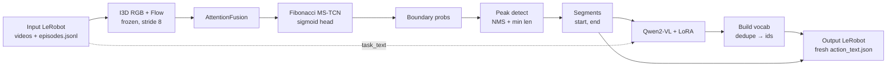

# V2 Pipeline — Class-Agnostic Boundary Detection + VLM Labeling

> **Status**: implemented
> **Replaces**: the original supervised RoboSubtaskNet (still on disk in `src/robosubtasknet/{models/robosubtasknet,losses}/*.py` and the `*_lerobot.py` scripts, kept for reference but no longer used by the shell entrypoints).
> **Why this exists**: heterogeneous robot demonstration datasets cannot share a unified subtask vocabulary; we segment first (class-agnostic), then label segments with a fine-tuned VLM.
> **Companion docs**: [`docs/BOUNDARY_DETECTION_NOTES.md`](docs/BOUNDARY_DETECTION_NOTES.md), [`docs/VLM_LORA_NOTES.md`](docs/VLM_LORA_NOTES.md).

## Table of contents

1. [Motivation](#1-motivation)
2. [Pipeline overview](#2-pipeline-overview)
3. [Stage 1 — Boundary segmenter](#3-stage-1--boundary-segmenter)
4. [Stage 2 — VLM segment labeler (Qwen2-VL + LoRA)](#4-stage-2--vlm-segment-labeler-qwen2-vl--lora)
5. [Stage 3 — End-to-end inference](#5-stage-3--end-to-end-inference)
6. [Data contracts](#6-data-contracts)
7. [Module layout](#7-module-layout)
8. [Training procedure](#8-training-procedure)
9. [Inference procedure](#9-inference-procedure)
10. [Hyperparameters](#10-hyperparameters)
11. [Reusable vs deprecated code](#11-reusable-vs-deprecated-code)
12. [Open questions / future work](#12-open-questions--future-work)

---

## 1. Motivation

The original RoboSubtaskNet ([`IMPLEMENTATION_PLAN.md`](IMPLEMENTATION_PLAN.md)) is a supervised, fixed-vocabulary MS-TCN++ — assumes one consistent label vocabulary across the corpus. True for GTEA/Breakfast, false the moment we ingest **multiple heterogeneous LeRobot dumps**: dataset A says `pick_cube`, B says `grab_object`, C uses free-form text; even shared strings often refer to different motor primitives. A fixed softmax head cannot learn this.

Two insights drive V2:

1. **Transitions are universal; labels are not.** Every annotation scheme agrees on *when* the gripper closes around the cup, even if they disagree on what to call the result. Segmentation decomposes cleanly into a class-agnostic boundary detector + a downstream labeler.
2. **VLMs eat the labeling problem cheaply.** A LoRA-tuned Qwen2-VL-2B maps `(frames, task)` → short verb phrase per segment. Free-form, dataset-agnostic labels, no vocabulary to maintain.

V2 keeps everything that paid off in V1 (I3D features, attention fusion, Fibonacci-dilated MS-TCN, T-MSE smoothness) and re-targets them at a *binary* task. The classifier head is the only architectural change.

---

## 2. Pipeline overview



Three logical stages, two trainable, one orchestrator. Stages 1 and 2 are **independent**: no shared gradients, no joint loss, parallelizable on separate GPUs after feature extraction. Coupling happens only at inference, via the segment list.

---

## 3. Stage 1 — Boundary segmenter

**Goal.** Predict a class-agnostic per-frame boundary probability `p(t) ∈ [0, 1]`.

**Architecture** (`src/robosubtasknet/boundary/model.py`). `AttentionFusion` (V1, unchanged) → 1 raw + 3 refinement `SingleStageTCN` stages, each 10 Fibonacci-dilated layers with hidden=64 and `num_classes=1` (single-channel head). Refinement stages consume `sigmoid` of the previous stage's logits. Final-stage `sigmoid` is `p(t)`.

**Training labels** (`scripts/extract_features_boundary.py`). For each LeRobot parquet, `boundary[t] = (action_text_id[t] != action_text_id[t-1])`. At I3D stride 8, `label[t_feat] = 1` iff *any* raw transition falls in `[t_feat·8, (t_feat+1)·8)` — intra-window transitions aren't lost. Cached per episode as `.npz` (`rgb`, `flow`, `labels`). Agnostic to what `action_text_id` indexes; only transitions matter.

**Loss** (`src/robosubtasknet/boundary/losses.py`).

```
L = Σ_stages [ BCE_pos_weighted(logits, soft_target) + λ_smooth · T-MSE(probs) ]
```

`make_soft_boundary_labels(boundaries, sigma=2)` convolves binary spikes with a unit-amplitude Gaussian (σ ≈ 2 feature frames ≈ 16 raw frames). Critical detail: vanilla 0/1 BCE collapses because positives are <10% of frames and the network gets no gradient near boundaries. `pos_weight=10` matches empirical density; `BoundarySmoothnessLoss(tau=4)` is the binary T-MSE analogue. All terms honor an explicit `mask` for padded batches.

**Inference / post-processing** (`boundary/postprocess.py`). `predict_probs` → `upsample_probs(original_T)` → `detect_boundaries(threshold=0.5, min_distance=3, prominence=0.1)` (`scipy.signal.find_peaks` with a NumPy fallback) → `boundaries_to_segments` produces half-open `(start, end)` and merges segments shorter than 5 into the smaller neighbor. `threshold` floors, `min_distance` is NMS, `prominence` suppresses Gaussian shoulders.

Alternatives survey (ASRF, BSN/BMN, ActionFormer, TW-FINCH, change-point): [`docs/BOUNDARY_DETECTION_NOTES.md`](docs/BOUNDARY_DETECTION_NOTES.md).

---

## 4. Stage 2 — VLM segment labeler (Qwen2-VL + LoRA)

**Goal.** Given a segment's frames and the episode-level task instruction, emit a short verb phrase (e.g. `"reach for the cup"`).

**Base model.** `Qwen/Qwen2-VL-2B-Instruct` (Apache 2.0); fits a 24 GB GPU with LoRA + bf16 + gradient checkpointing. 7B variant is a drop-in swap. Alternatives surveyed (LLaVA-NeXT-Video, InternVL2, MiniCPM-V, Gemini/GPT-4o as offline teachers) in [`docs/VLM_LORA_NOTES.md`](docs/VLM_LORA_NOTES.md) §2.

**LoRA** (`src/robosubtasknet/vlm/model.py`). `peft.LoraConfig(task_type=CAUSAL_LM)`, rank 16, alpha 32, dropout 0.05. Targets attention (`q,k,v,o_proj`) + MLP (`gate,up,down_proj`) — standard Qwen "all-linear minus embeddings/head". **Vision encoder kept frozen**: robot footage transfers well from natural-video pretraining; fine-tuning it risks catastrophic forgetting on ~10k-segment datasets.

**Chat template** (`make_segment_chat`):

```
system:    "You label robot manipulation subtasks. ... single concise verb phrase ..."
user:      <video> + "Task: <task_text>. What subtask is happening?"
assistant: <subtask_text>      # appended only during training
```

**Training data** (`src/robosubtasknet/vlm/dataset.py`). Per episode, derive segments from `episode["action_config"]` (preferred) or RLE-encode `action_text_id` via `meta/action_text.json` (fallback). Each segment yields one `(frames, task_text, subtask_text)` triplet: 8 frames sampled uniformly across `[start, end)`, resized to 224×224. Filter segments <4 frames or labeled `"background"`; optional `max_segments_per_episode` cap prevents long-episode dominance.

**Loss masking** (`vlm/collator.py`). Cross-entropy on assistant-turn tokens only; system+user tokens masked with `-100`.

**Training loop.** HF `Trainer`, AdamW lr=2e-4, 3% cosine warmup, bf16, gradient checkpointing, per-device batch 1, accumulation 8. `model.enable_input_require_grads()` set so LoRA gradients flow under checkpointing.

**Inference.** Greedy decoding (`do_sample=False`, `max_new_tokens=64`). For episodes lacking a `tasks` field, the orchestrator first prompts the VLM zero-shot to summarize the episode (`predict_task_text`) and reuses that as `task_text`.

---

## 5. Stage 3 — End-to-end inference

The orchestrator (`src/robosubtasknet/pipeline/inference.py`, CLI `scripts/inference_pipeline.py`) chains the two stages across a complete LeRobot dataset and materializes a fresh, internally consistent LeRobot dataset at the output path.

Per-episode flow:

1. Read `length`, optional `tasks` from `meta/episodes.jsonl`.
2. Extract I3D RGB + Flow features for the configured camera key (stride 8).
3. Boundary segmenter → per-feature-step probability map.
4. Post-process: upsample → peak detect → segment list in original-frame coords.
5. Sample 8 frames per segment (`decord`), resize to 224×224.
6. If `tasks` is missing and `predict_task_if_missing=True`, synthesize a task description via zero-shot VLM over the whole episode.
7. Label each segment with `SegmentLabelerVLM.label_segment(frames, task_text)`.
8. Accumulate predictions into an **output vocabulary**: deduplicated phrases → sequential integer ids, built **incrementally during the run** and written to `meta/action_text.json` at the end.
9. Expand segments back to a per-frame `action_text_id` array; write the output parquet.
10. Hard-link **every** camera's mp4 for this episode into the output tree.

The output `action_text.json` is built fresh — it does **not** inherit the input vocabulary. Downstream consumers still get integer ids, so any tooling expecting classical multi-class supervision keeps working.

---

## 6. Data contracts

### Input LeRobot dataset

| Use case | Required fields |
|---|---|
| Boundary training | parquet column `action_text_id` (to derive boundaries) |
| VLM training | `episode["tasks"]` in `episodes.jsonl` + (`episode["action_config"]` OR `action_text_id`+`meta/action_text.json`) |
| Inference only | `videos/chunk-N/<camera>/episode_M.mp4` + `episodes.jsonl` with `length`. **No** `action_text_id` or `action_text.json` required. |

If `episode["tasks"]` is missing at inference, the VLM synthesizes one when `predict_task_if_missing=True`.

### Output LeRobot dataset (CRITICAL — input is never modified)

A brand-new dataset at `<output>`:

- `data/chunk-N/episode_M.parquet`: every input column preserved; `action_text_id` **overwritten/added** with predicted per-frame ids.
- `videos/chunk-N/<cam>/episode_M.mp4`: **hard-linked** (`os.link`) from input. **All cameras**, not just the prediction-driving one. Cross-filesystem `EXDEV` falls back to symlink with a warning rather than silently copying gigabytes.
- `meta/info.json`: copied, with `total_episodes`/`total_frames` updated.
- `meta/tasks.jsonl`: copied verbatim.
- `meta/episodes.jsonl`: copied per-episode, `action_config` **replaced** by an RLE-derived segment list from the predicted ids.
- `meta/episodes_stats.jsonl`: copied as-is.
- `meta/action_text.json`: **built fresh** from deduplicated predicted phrases (sequential ids starting at 0). Does **not** inherit input vocabulary.

Helpers in `src/robosubtasknet/data/lerobot_writer.py` cover hard-linking, RLE → `action_config`, and meta-file emission.

---

## 7. Module layout

```
src/robosubtasknet/
├── features/                       (reused: I3D, flow, extract CLI)
├── models/{fusion,tcn}.py          (reused; deprecated: robosubtasknet.py)
├── losses/                         [DEPRECATED — multi-class CE + transition]
├── training/                       (reused: Trainer, scheduler, callbacks)
├── eval/metrics.py                 (reused: F1@k on boundary events)
├── boundary/                       NEW
│   ├── model.py        BoundarySegmenter
│   ├── losses.py       CompositeBoundaryLoss, make_soft_boundary_labels
│   ├── dataset.py      BoundaryDataset, pad_collate_boundary
│   └── postprocess.py  detect_boundaries, boundaries_to_segments
├── vlm/                            NEW
│   ├── model.py        SegmentLabelerVLM, make_segment_chat
│   ├── dataset.py      VLMSegmentDataset
│   ├── collator.py     VLMSegmentCollator (label masking)
│   ├── training.py     train_lora (HF Trainer wrapper)
│   └── inference.py    sample_segment_frames, label_segments, predict_task_text
├── pipeline/inference.py           NEW   (e2e orchestrator)
└── data/lerobot_writer.py          (reused)

scripts/
├── extract_features_boundary.py    NEW
├── train_boundary.py               NEW
├── train_vlm.py                    NEW
├── inference_pipeline.py           NEW
├── train.sh                        REPLACED  (chains features → boundary → VLM)
└── inference.sh                    REPLACED

configs/{boundary,vlm,pipeline}.yaml   NEW
docs/{BOUNDARY_DETECTION_NOTES,VLM_LORA_NOTES}.md   NEW
```

---

## 8. Training procedure

Both stages train independently after feature extraction. `scripts/train.sh` chains them sequentially; or run them in parallel on separate GPUs.

```bash
./scripts/train.sh ./boundary_cache ./out \
    /data/lerobot_d1:observation.images.head_left_eye \
    /data/lerobot_d2:observation.images.front_cam
```

Three steps: (1) `extract_features_boundary.py` — idempotent, skips cached episodes; (2) `train_boundary.py` — ~50 epochs, batch 1, AdamW + cosine, reuses the project-wide `Trainer`; (3) `train_vlm.py` — HF `Trainer`, bf16, gradient checkpointing, LoRA-only, writes `lora_adapter/` + `metadata.json`. Steps 2 and 3 share no state.

---

## 9. Inference procedure

One shell command produces a fresh, fully-labeled LeRobot dataset:

```bash
./scripts/inference.sh /data/raw_demos ./auto_labeled \
    ./out/boundary/final.pt ./out/vlm/lora_adapter \
    observation.images.head_left_eye
```

`inference_pipeline.py` loads both checkpoints, iterates `episodes.jsonl`, runs Stage 1 + post-processing + Stage 2 per episode, accumulates the output vocabulary, and writes the new dataset. All cameras are hard-linked; the input is never touched; the output is internally consistent (parquet `action_text_id` agrees with `meta/action_text.json` and `episodes.jsonl["action_config"]`). Empty/missing VLM adapter path → fallback to base Qwen2-VL with no LoRA (useful as zero-shot baseline).

---

## 10. Hyperparameters

### Stage 1 — boundary segmenter (`configs/boundary.yaml`)

| Key | Value | Rationale |
|---|---|---|
| `num_stages` / `num_layers` | 4 / 10 | 1 raw + 3 refinement; Fibonacci dilations `[1,2,3,5,8,13,21,34,55,89]`, RF ≈ 470 feat steps |
| `feature_dim` / `hidden_dim` / `dropout` | 1024 / 64 / 0.5 | I3D + MS-TCN convention |
| `boundary.sigma` | 2.0 | ≈ 16 raw frames; wide enough for gradient, narrow enough not to merge boundaries |
| `boundary.pos_weight` | 10.0 | Matches 5-10% positive density |
| `boundary.lambda_smooth` / `tmse_tau` | 0.15 / 4.0 | MS-TCN T-MSE defaults |
| `feature_stride` | 8 | I3D temporal stride |
| `training.lr` / `epochs` / `batch_size` | 5e-4 / 50 / 1 | AdamW + cosine; bs=1 for variable-length videos |
| `postprocess.threshold` / `min_distance` / `min_segment_length` / `prominence` | 0.5 / 3 / 5 / 0.1 | Peak floor / NMS / merge / shoulder suppression |

Full rationale: [`docs/BOUNDARY_DETECTION_NOTES.md`](docs/BOUNDARY_DETECTION_NOTES.md) §4.

### Stage 2 — VLM labeler (`configs/vlm.yaml`)

| Key | Value | Rationale |
|---|---|---|
| `model_name` / `torch_dtype` | `Qwen/Qwen2-VL-2B-Instruct` / `bfloat16` | 24 GB GPU fit |
| `lora.rank` / `alpha` / `dropout` | 16 / 32 / 0.05 | Balanced quality/memory; α = 2·rank standard |
| `lora.target_modules` | attn + MLP linears | Standard Qwen recipe; vision frozen |
| `training.lr` / `epochs` / `warmup_ratio` | 2e-4 / 3 / 0.03 | LoRA-friendly lr; small adapters overfit fast |
| `per_device_batch_size` / `gradient_accumulation_steps` | 1 / 8 | Effective batch 8 |
| `data.n_frames` / `frame_size` | 8 / 224×224 | Qwen2-VL defaults |
| `data.min_segment_length_frames` / `skip_background` | 4 / true | Filter noise + uninformative supervision |

Full rationale: [`docs/VLM_LORA_NOTES.md`](docs/VLM_LORA_NOTES.md).

### Stage 3 — pipeline (`configs/pipeline.yaml`)

Mirrors the postprocess and VLM blocks; the only orchestrator-specific knob is `predict_task_if_missing: true`, letting the pipeline self-synthesize a task description for episodes whose metadata lacks one.

---

## 11. Reusable vs deprecated code

**Reusable (active in V2).** `features/{i3d,flow,extract}`; `models/{fusion,tcn}` (instantiated with `num_classes=1`); `training/{trainer,scheduler,callbacks}`; `data/lerobot_writer.py`; `eval/metrics.py` (F1@k still natural for boundary events).

**Deprecated (kept for V1 paper-reproduction path).** `models/robosubtasknet.py`; `losses/{composite,tmse,transition}.py`; `scripts/{extract_features,train,inference}_lerobot.py`; `configs/{breakfast,gtea,lerobot,robosubtask}.yaml`. V2 entrypoints reference none of these; removing them is a future cleanup.

---

## 12. Open questions / future work

- **Boundary calibration.** We floor at threshold 0.5. The absolute probability scale may shift OOD; peak-only selection or per-episode adaptive thresholding is the obvious next experiment.
- **VLM evaluation regime.** Teacher-forcing perplexity and free-generation BLEU/CIDEr disagree for short verb phrases. A small human-annotated held-out split is needed to ground-truth this.
- **Joint training.** Stages 1 and 2 are independent. A joint objective could propagate label quality back into segmentation, but gradient flow through `find_peaks` is non-trivial and expected gain is modest.
- **Teacher distillation.** Pseudo-labeling with Gemini / GPT-4o-vision on a subset and using those as Qwen2-VL fine-tune targets is the highest-leverage next labeling improvement.
- **Multi-camera fusion.** Boundary prediction currently runs on a single camera per dataset. Combining views (head + wrist) at the I3D feature level might sharpen contact-event localization.
- **Confidence-gated dropping.** Quarantining segments where the VLM top-1 probability is low would improve downstream training quality.
